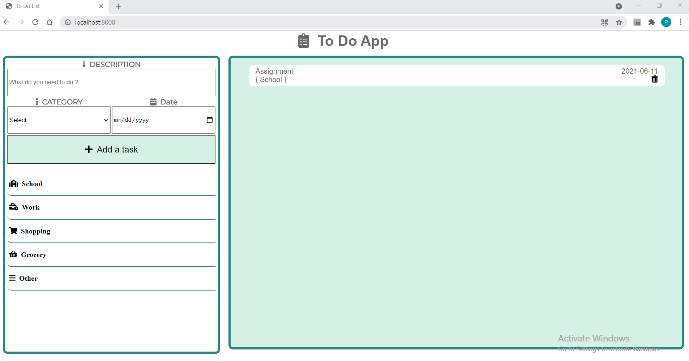

# assignmentToDO

## Folow the instruction step by step

```
1.  Clone the repo from this link https://github.com/Parmodverma27111/assignmentToDO.git
2.  Install nodejs
3.  Open you terminal and type "npm start"
4.  After that, Project will run on given port(most probabili it will be port no 8000)
5.  Open your chrome and type http://localhost:(portNumber)/
```


## Preview


